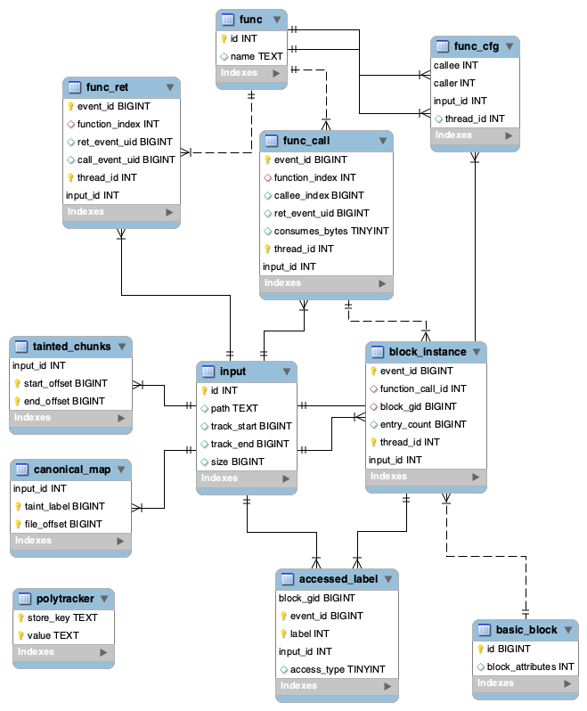

### PolyTracker Artifacts 

When PolyTracker completes a run it outputs two files, a sqlite database and a `forest.bin`. 

### PolyTracker Database Schema


For every instrumented parser, there is a database that is associated with it. 

0. input: this table contains a list of input files and the ranges of bytes that were tracked
1. func: this is a table of functions within the parser and their associated indexes 
2. basic_block: this is a table of basic blocks within the parser and their associated indexes
3. polytracker: this is a generic table which allows us to store metadata without changing the schema 
4. func_cfg: contains runtime control flow graph infomration 
5. func_call: when POLYTRACE is enabled, this keeps track of function call events 
6. func_ret: when POLYTRACE is enabled, this keeps track of function ret events 
7. block_instance: when POLYTRACE is enabled, this keeps track of all generic basic block events
8. accessed_label: associates events with accessed taint
9. canonical_map: maps canonical taint labels to file offsets 
10. tainted_chunks: list of read events from the parser that records what file offset chunks were read

Note: This is hard to see in the schema, but the block_gid is split between the function index and the block index. 
The high bits are the function index, and the lower bits are the block index. 

### PolyTracker Forest
The second artifact produced by PolyTracker is the provenance forest. The provenance forest is a
directed acyclic graph used by PolyTracker to store associations between taint labels. The schema
of the forest.bin is the following: 

```

 file offset 0  (Node 0) 
[ parent 1 ] [ parent 2 ]
[  4 bytes ] [ 4 bytes  ]
```

Each 8 byte chunk in the file represents a node, and within that 8 byte chunk 
there are two 32 bit integers. These integers represent the parents for this node. 
If both parents are 0, that means the node is `canonical`, and directly represents a stream
offset. This offset can be found in the `canonical_mapping` table. 