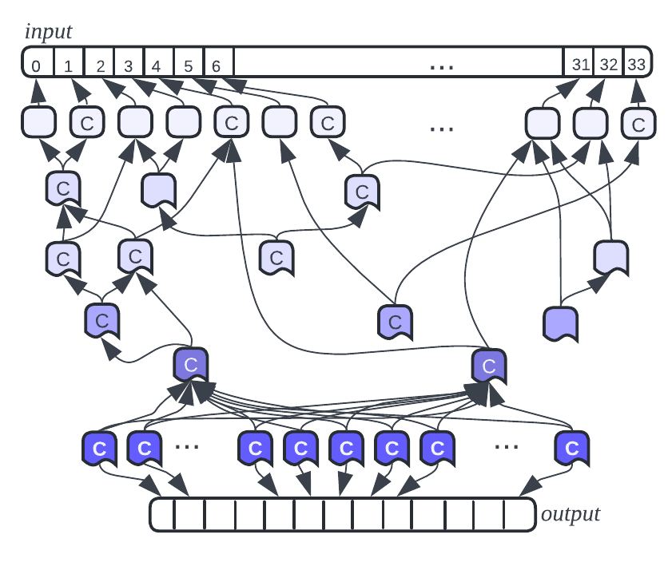
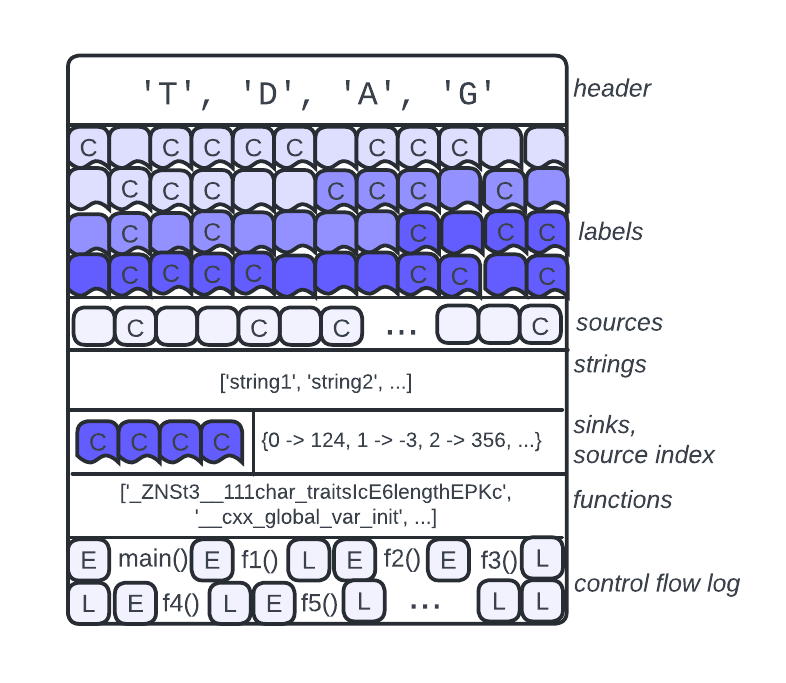

# The Tainted Directed Acyclic Graph (TDAG) File Format

Please see [our ISSTA paper](https://github.com/trailofbits/publications/blob/master/papers/issta24-polytracker.pdf) for a more formal version (as of July 2024) of the documentation that follows.

PolyTracker uses static instrumentation placed with several [LLVM passes](../polytracker/include/polytracker/passes) to produce several different but complementary kinds of runtime program information in the TDAG format.

The Tainted Directed Acyclic Graph (TaintDAG, TDAG) binary file format is an abstract representation of the directed acyclic graph of each taint label recorded at execution time and the provenance relationships between them. Each provenance relationship between labels is directed (each label knows about its two most immediate ancestors, if it's not a source label). The acyclic nature of this graph is a result of processing input bytes and tracing those processing operations during parsing. Here's an idea of what we're talking about:

<p align="center">
  
</p>

*Figure: an idealized Tainted Directed Acyclic Graph. Increase in color saturation indicates the accumulation of data flow taint.*

We store PolyTracker traces as TDAG files so they can be analyzed after they are recorded. Whenever a PolyTracker-instrumented binary runs, that binary produces a new TDAG. Unlike other information flow tracking tools, PolyTracker does not currently do any "online" analysis at runtime! We store PolyTracker traces in the TDAG format so that we can "post-hoc" or "offline" conduct sampled analyses, differential (comparative) analyses between traces, and other types of analyses that are not possible at runtime. Conveniently enough, this also means we don't need to spend runtime tracing memory on analysis operations and can separately optimize our analyses.

Parsing code that can read TDAGs and produces Python data structures from the sections of TDAG files primarily lives in [taint_dag.py](../polytracker/taint_dag.py). This "read side" code directly corresponds to the C++ header-file definitions we use to write a TDAG file as we build up data flow information, which can be found in [polytracker/include/taintdag](../polytracker/include/taintdag).

The size of a given TDAG depends not only on the size of the input traced, but also on the complexity of the operations the instrumented software did with the input bytes. Some TDAGS, understatement, are quite large. To reduce the number of file system operations needed, the `polytracker` Python library memory [maps the contents of the TDAG into process memory](https://github.com/trailofbits/polytracker/blob/master/polytracker/taint_dag.py#L451) (via `mmap()`). This makes it possible to work with ``raw'' TDAGs exactly like one might work with an array or a buffer. While we currently use a number of buffer copies for operations on the TDAG, this strategy will eventually prove unsustainable for tracing more complex algorithms (such as zlib decompression) run on larger inputs.

## Layout

Each TDAG includes a number of subsections; the largest of these is typically the labels section, followed by the control flow log section. The following image is an idealized representation of what you'll find in an average TDAG (as of July 2024). Note that this drawing doesn't include directly, for example, the bitmap section.

<p align="center">
  
</p>

*Figure: Layout of an idealized TDAG. Increase in color saturation indicates the accumulation of data flow taint.*

Every [section](../polytracker/include/taintdag/section.h) in the TDAG has a predefined size, entry size, and optionally also spacing/padding between entries. The sections available in a TDAG file are accessed by tag by the class `TDFile` in [taint_dag.py](../polytracker/taint_dag.py).

Some specifics:
- [File Header](../polytracker/include/taintdag/outputfile.h): this header consists of the TDAG magic bytes, and then "meta" information used to determine the number, type, and contents of the sections that follow FileHeader. This is what `TDFile` is going to interpret to figure out what to do with the rest of the file contents.
- [Labels](../polytracker/src/taintdag/) consists of the tainted information flow labels recorded at runtime
- [Sources](../polytracker/src/taint_sources/taint_sources.cpp) contains source labels (byte offsets into the input)
- The Source Label Index is a bitmap that defines how to index the sources section.
- [Sinks](../polytracker/include/taintdag/sink.h) contains sink labels (representing bytes of the output)
- [Strings](../polytracker/include/taintdag/string_table.h) todo(kaoudis) the string table is used in conjunction with the fnmapping to put together an earlier version of the control flow log used for grammar extraction
- [Functions](../polytracker/include/taintdag/fnmapping.h) todo(kaoudis) this contains an early version of the function list part of the control flow log used for grammar extraction
- [Events](../polytracker/include/taintdag/fntrace.h) todo(kaoudis) this contains an early version of the entry and exit events used to structure the control flow log
- [Control Flow Log](../polytracker/include/taintdag/control_flow_log.h): this consists of the function entry and exit records we need to reconstruct the call stack that data flow passed through.

## TDAG Contents

You'll notice the TDAG doesn't just include data flow labels, but also has the other information we collect as well. We use LLVM passes to place several different kinds of static instrumentation at build time. Via this instrumentation, the PolyTracker library will collect different, complementary, aspects of runtime information flow.

We track a couple different kinds of information flow, and record them all together in different sections of the same file:
- dynamic information flow trace labels (taint labels)
- "affects-control-flow" label tags (represented with the letter C in the above figure)
- function entries and exits that correspond to the function log for callstack reconstruction purposes

We also include the following more static data:
- the function log that corresponds to the section of the control flow graph our data flow trace followed
- the index of source bytes, and a mapping between source bytes and initial labels
- the index of sink bytes

Once the TDAG of interest has been read in, we can re-construct information that is useful for analyses, such as:
- provenance relationships for each intermediate label (these tell you how we got a particular label and what data it descends from; these relationships also can be leveraged to determine what other labels descend from the label of interest), and
- the control flow log to label mapping for each intermediate label (this tells you where/when we recorded the label during execution).

## Labels

Each label is currently of size `uint32_t`, but because we store other data that describes the label in a bit vector right alongside it, we use an `uint64_t` ("`storage_t`") to hold all of this. See `label_t` and `storage_t` in [taint.h](../polytracker/include/taintdag/taint.h). See [encoding.h](../polytracker/include/taintdag/encoding.h) comments in [encoding.cpp](../polytracker/src/taintdag/encoding.cpp) for some description of what actually goes in a "taint label".

As the instrumented binary operates on the now labeled data, the associated taint labels need to reflect those operations. For example, if the instrumented program happens to add two tainted values, we will create a new taint label to represent the addition's result. The new label should reflect the union of the operand labels.

### Source Labels

Whenever the instrumented program reads in data, by default, we label each byte of that input as a *taint source*. PolyTracker can also use either stdin and all of argv as sources of taint, but you'll need to set either `POLYTRACKER_STDIN_SOURCE` or `POLYTRACKER_TAINT_ARGV` to make that work. When we work with sources on the "read" or analysis side of PolyTracker, each `source` has a reference to the input file it came from.

### Shadow Memory Usage

As a note for the unwary, how we use shadow memory differs a bit from how you might expect DFSan to operate. We primarily cache intermediate labels there: a given label needs to be written out to the TDAG file before we can add to shadow memory a new descendant label resulting from a range or union operation involving that initial label.

```C
  uint32_t a = ...;
  uint32_t b = ...;
  uint32_t result = a + b;
```

For the above case the taint label of `result` represents a union of the taint labels of `a` and `b`. The labels of `a` and `b` will be written out to the labels section of the TDAG before we add the label corresponding to `result` to shadow memory.

### Range Versus Union

If the taint labels considered for a union are adjacent in memory, for example, two consecutive source taint bytes, we create a *range* label instead. Unions and ranges occupy the same amount of storage. The main difference between these two label creation operations and the resulting label types is that a range can be "extended" to become a larger range.

Consider the following operation on source bytes

```C
uint8_t src[1024];
// read source taint
uint32_t val = *(uint32_t*)src;
```

In this example `val` should be labeled with the union of the four consecutive source taint lables. In this case a range is instead created representing all four labels.

The main motivation for introducing ranges is to allow for efficient membership testing. If a taint label is already included in a range of taint values, the range can be reused. It is possible to unfold the range into a tree of unions and walk the tree, but that requires more computation.

```C
uint8_t src[1024];
// read source taint
uint32_t val1 = *(uint32_t*)src;
uint32_t val2 = val1 + src[1];
```

In this slightly extended example the label of `val2` can be made equal to `val1`. It depends on the exact same source labels. Ranges make checking for such cases more efficient.

## `affects_control_flow`

When we find that the value tagged with a particular taint label affects control flow, we set a bit on the label indicating such on the write side (see [taint.h](../polytracker/include/taintdag/taint.h) for the definition and [labels.h](../polytracker/include/taintdag/labels.h) for how we do this). On the read side, we represent this property for labels using the Boolean value `affects_control_flow` (see [taint_dag.py](../polytracker/taint_dag.py)).

If a parent of a given label has `affects_control_flow` set, we also set `affects_control_flow` for the label. This means that `affects_control_flow` is a distinctly tracked type of tainted information flow from our main data flow! As well, note that if a value with a union or range label `W` affects control flow, then each taint label represented by `W` is in turn marked as affecting control flow.

A simple example of a control-flow-affecting data flow operation is: a value with taint label `L` is read from file, compared against another value, and a branch is taken based on the result. Whenever the conditional branch is executed, the taint with label `L` is marked as affecting control flow.

## Portability

We store all values in their native endianness. This file format is currently not portable.